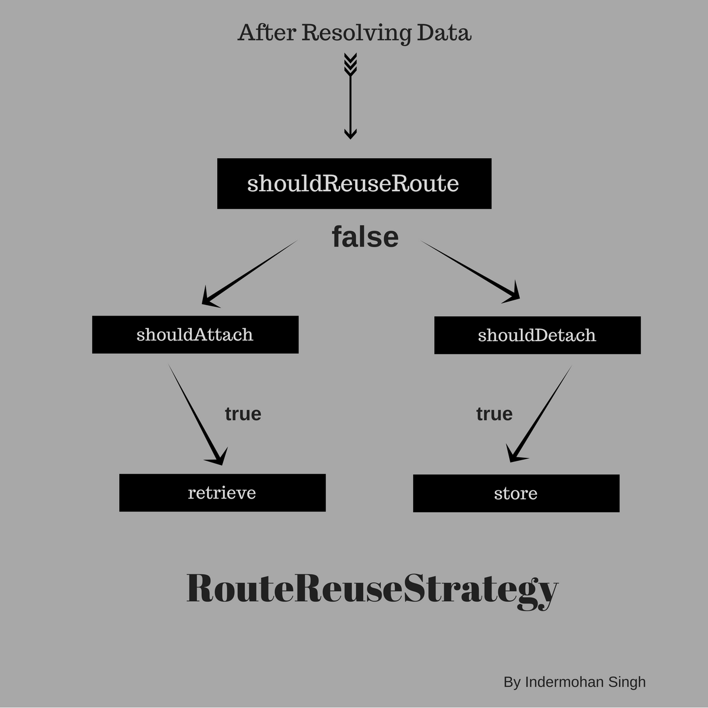

# RouteReuseStrategy in Angular

There are two questions I ask myself when I am learning new technology.

1.  Why we need it?
3.  How to implement it?

## Why we need it?

Before we dig into, how we can use RouteReuseStrategy, let's understand why we need to learn it.

Following is very basic router configuration in Angular application.

```
const routes: Routes = [
  { path: "home", component: HomeComponent },
  { path: "next", component: NextComponent },
  { path: "", redirectTo: "/home", pathMatch: "full" }
];
```

In above example code, we have three routes. Routes have component associated with them. In this case, HomeComponent and NextComponent are linked to **"/home"** and **"/next"** respectively. These components are called as Application Component.

By default, whenever user navigates from one route to another. Angular creates a new instance of the application component and render it on the screen. In some cases, you might want to save the state of component and reuse it later on. That's where RouteReuseStrategy comes in.

One of the best example is Search Result List. User searches something, then opens one of the result and then go back to search result list. In that specific example, you might want to reuse the search result list component. Take a look at [Ragakosh.](https://ragakosh.com)

### What is RouteReuseStrategy?
Basicaly, RouteReuseStrategy allow us to customize the way Angular reuse activated routes(application component).

Everytime user click on any url inside angular application. Angular router goes through a specific process. Let's briefly overview this process. It actually takes 7 step approach to show the view.

1. Parse: First it parses the browser url where user wants to navigate.
2. Redirect: If it is a redirect, router applies URL redirect.
3. Identify: It identifies which router state(application component) is associated with that specific URL.
4. Guard: Run guards which are defined in router config.
5. Resolve: It resolves the needed data for the specific router state.
6. Activate: Router Activates the angular component to display on view.
7. Manage: Manage navigation and repeat these steps again for new url.

RouteReuseStrategy comes in step 6. There is a default strategy used by Angular and this is how it works. When user clicks on the url, router checks if only route parameters are changed, then associated component is not re-instantited but just reactivated again. Component has access to latest parameters using Observables. But if navigation requires new component, then it re-inititates the component and project it via ```<router-outlet></router-outlet>```

### How does this helps?
* **Caching** : Component state is saved. So user see the exact state when he left the component preivously.
* **Speed** : Of course, if you are caching it, it increases the speed.
* **Less HTTP Requests** : If your component makes http request on initiation, you now have less requests to make.

## How to implement it?

### 1. Implement custom strategy
we will start by creating a custom strategy which implements the default one. Let's name the file reuse-strategy.ts

```
import { RouteReuseStrategy } from '@angular/router';
export class CustomStrategy implements RouteReuseStrategy {

}
```



Strategy should have 5 methods implemented. These are as follows:

1. shouldReuseRoute
2. shouldDetach
3. store
4. shouldAttach
5. retrieve

#### shouldReuseRoute:
Think of this as an entry point to the strategy. If this method returns **true**, we are basically saying that use the current component for the next route. If this method returns **false**, then other methods are called.

#### shouldDetach:
If shouldReuseRoute returns false, then this method is called. In this method, we basically decides if we should save the snapshot of current route for later **re-use**. We can implement any logic suited to our need. Whatever this method returns decides if store method should be called or not.

#### store:
If shouldDetach returns **true**, this method is called. Here we store the snapshot of the route.

#### shouldAttach:
if shouldReuseRoute return false, then this method is called. In this method, we decides if we want to re-use previously saved snapshot. 

#### retrieve:
if shouldAttach returns **true**, this method is called. We return back the snapshot of the current route.

### Example Strategy
```
import { RouteReuseStrategy, ActivatedRouteSnapshot, DetachedRouteHandle } from '@angular/router';
interface RouteObject {
    snapshot: ActivatedRouteSnapshot;
    handle: DetachedRouteHandle;
}
export class CustomStrategy implements RouteReuseStrategy {
    routesStore = [];
    // if routes should be detached to reuse later
    shouldDetach(route: ActivatedRouteSnapshot) {
        // console.log('shouldDetach');
        const url: string = route.routeConfig.path;
        const shouldCache: Boolean = route.data.cache;
        return shouldCache &&  !this.routesStore[url];
    }

    // store the detached routes
    store(route: ActivatedRouteSnapshot, handle: DetachedRouteHandle) {
        const url = route.routeConfig.path;
        const routeObject: RouteObject = {
            snapshot: route,
            handle: handle
        };
        this.routesStore[url] = routeObject;
    }

    // if already stored routes should be reattached
    shouldAttach(route: ActivatedRouteSnapshot) {
        const url = route.routeConfig.path;
        return !!this.routesStore[url];
    }

    // retrieve the routes from store
    retrieve(route: ActivatedRouteSnapshot) {
        const url = route.routeConfig.path;
        return this.routesStore[url].handle;
    }
    // check if routes should be reused at all
    shouldReuseRoute(future: ActivatedRouteSnapshot, current: ActivatedRouteSnapshot) {
      return future.routeConfig === current.routeConfig;
    }
}
```

### 2. Enable the custom strategy
You need to import both RouteReuseStrategy and custom strategy in the root NgModule file, app.module.ts

```
import { RouteReuseStrategy } from '@angular/router';
import { CustomStrategy } from './reuse-strategy.ts';
...
@NgModule({
    ...
    providers: [
        { provide: RouteReuseStrategy, useClass: CustomStrategy }
    ]
})
```

### 3. Enable Caching via Router Config

The way we have implemented it is using Resolve data. So we need to set a flag in the router config to resolve data to activate/deactivate caching of component.

```
const routes: Routes = [
  { path: "home", component: HomeComponent, data: { cache: true } },
  { path: "next", component: NextComponent data: {cache: false } },
  { path: "", redirectTo: "/home", pathMatch: "full" }
];
```
That's it.

## Further Reading

* [The 7 Step process of Angular Router Navigation](https://www.jvandemo.com/the-7-step-process-of-angular-router-navigation/) a blog post by *Jurgen Van de Moere*.
* [Angular Router](https://leanpub.com/router) Angular router bible by *Victor Savkin*.